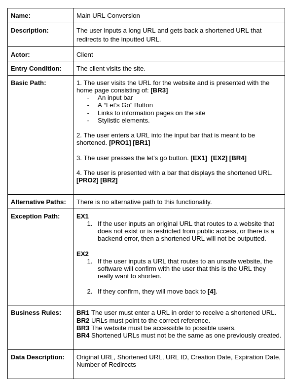
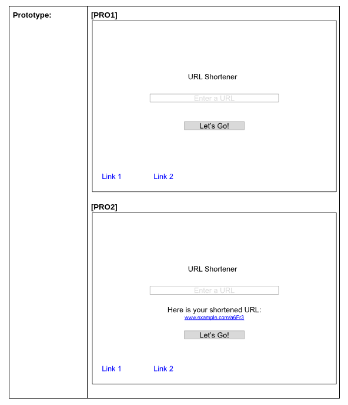
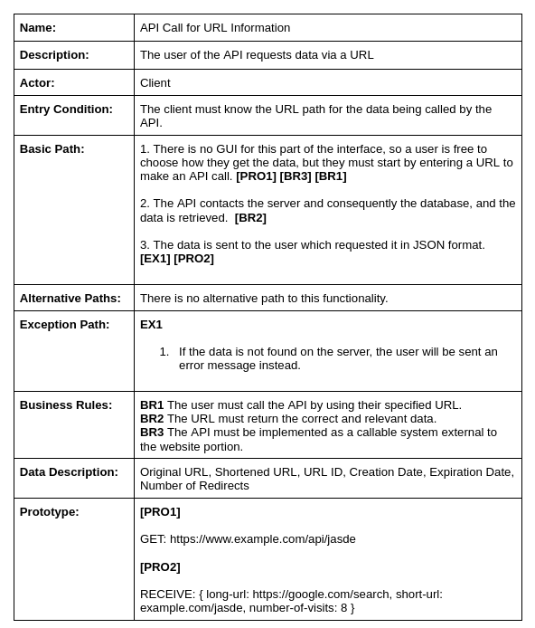

# Sprint 1

##VIDEO: 

## Use Cases

## Progress Made

This phase of the project had a lot of devops, as we were focused on getting the infrastructure of the project up and running. The project runs currently in a Docker environment with a PostgreSQL database and a Vite / React / Typescript frontend. An API was developed for the backend as well that makes implementing new functionality and providing additional services to users a bit more manageable. In this iteration, we focused on creating the core of our application, which takes a long URL and returns copied to the clipboard a shortened version of that same URL. We also provide an API that allows an outside developer to retrieve data about the URL they created by calling the API in the environment of their choosing. 

## Difficulties

Decision making proved to be one of the largest sources of difficulty in this iteration of the project, as many decisions had to be made about what to include and what not to include, as well as about what platforms those features would be implemented with. A lot of learning had to be done in this stage about the tecnologies that would make up this project, and about how those may be integrated together in a larger system. 

## Test Cases
