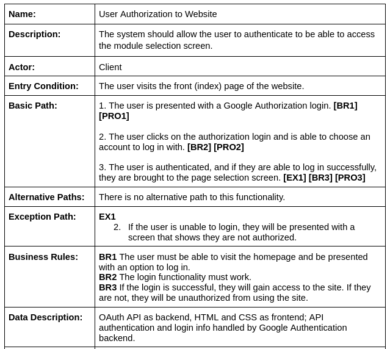
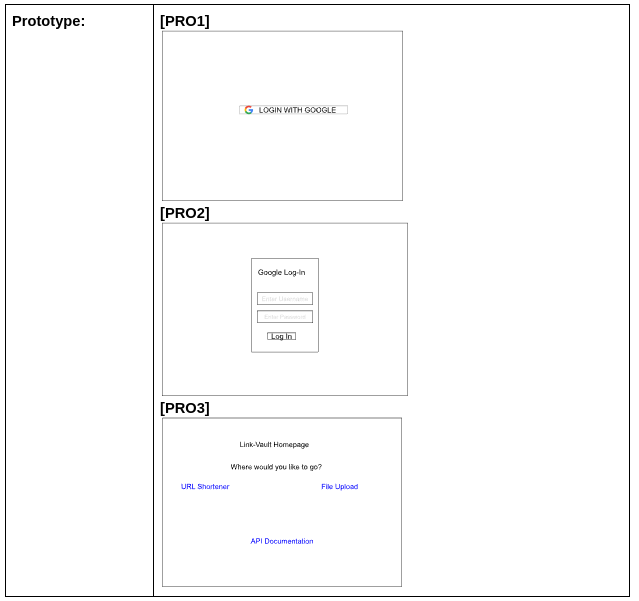
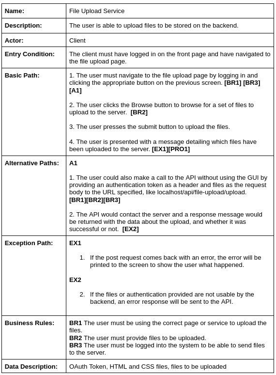
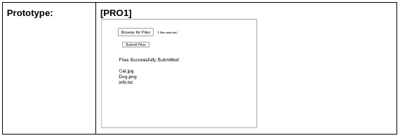

# Sprint 2

## Use Cases

## Progress Made

In this sprint, we focused on two main new parts of the program, namely creating the authentication service that would ensure that users using the site would be ones approved by the organization, and a file upload service, in which a user is able to upload a file to the server to be stored on the file. The authentication service was implemented using Google OAuth and sits at the front page of the website. The user is greeted with it at first login, and must do the process in order to get to the true homepage of the site, which has the option to select to go either to the file upload or the URL shortener. The file upload has a button that allows for files to be uploaded, and once uploaded, the server responds and tells the name of the original file and the path it is stored on in the computer. 

## Difficulties

This phase included a pretty significant refactoring of the site, as instead of essentially being a single page application with some additional info pages, we had to create an authentication page, a page to choose which service you are going to use, and then separate pages for each of the services. This provided some more devops difficulties, and required more maneuvering in order to only allow certain things to users who were authenticated. Otherwise, the sprint went smoothly and we were able to get everything set up in the way that we wanted. 

## Test Cases

