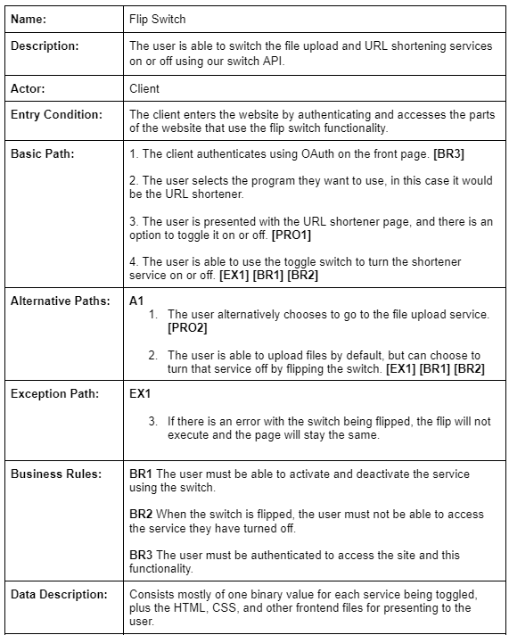

# Sprint 3

## Use Cases

## Progress Made

We focused on the flip switch functionality for this sprint, which we were able to use to control the toggling on and off of different services available on the Link Vault site. The switch is implemented as a call to an API contained in our backend, which is then sent a mock "signal" to turn the binary value on or off for the particular switch. This could be useful as the website grows and more services are added, as we are able to let users customize what they are and are not able to see, especially if we were able to integrate all services into a single page application sort of model. Overall, we are happy with the direction and functionality of the project. 

## Difficulties

This sprint, we focused on having people working on portions of the project they were less familiar with, so much of the difficulty of this sprint likely came down to parts of the project where members of the team were learning new functionality and working in languages and paradigms that they haven't worked in before. The implementation went relatively smoothly, though, and there was not a ton of difficulty in this sprint, especially compared to the more daunting implementations of the prior two sprints. 

## UML Diagram

## Test Cases
